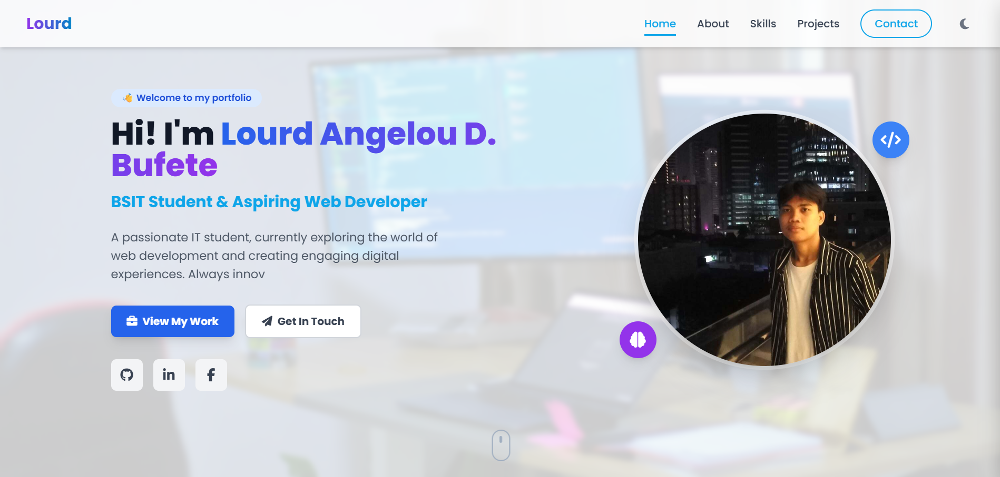
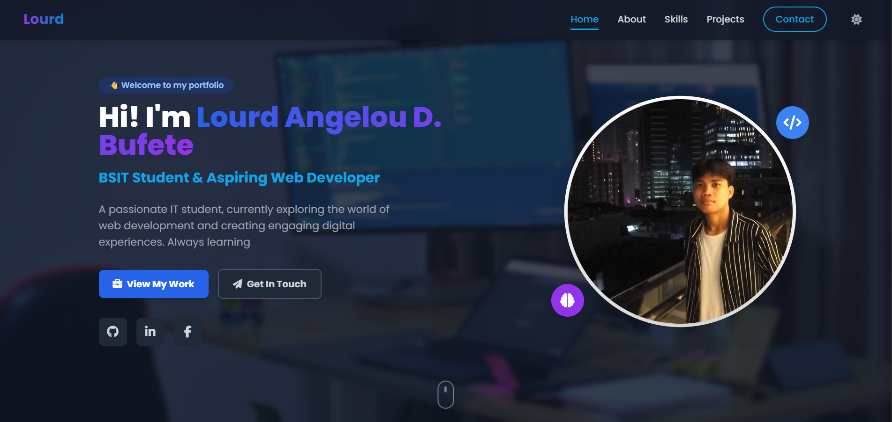

# Lourd Bufete - Personal Portfolio



Welcome to the source code for my personal portfolio website. This project is a fully responsive, single-page application built with **React** and **Tailwind CSS** to showcase my skills, featured projects, and professional background as an aspiring web developer.

**Check out the live demo:** **[https://<YOUR_LIVE_URL_HERE.com>](https://lourd-portfolio.onrender.com)**

---

## 📖 Table of Contents

* [About This Project](#-about-this-project)
* [✨ Key Features](#-key-features)
* [📸 UI Showcase (Light & Dark Mode)](#-ui-showcase-light--dark-mode)
* [🛠️ Tech Stack](#️-tech-stack)
* [⚙️ Getting Started](#️-getting-started)
* [📬 Connect With Me](#-connect-with-me)

---

## About This Project

This portfolio serves as my digital resume and a central hub for my work. It's designed to be clean, modern, and interactive, providing a seamless user experience for anyone interested in learning more about me and my technical abilities. The entire site is built from scratch to reflect my skills in front-end development and design.

---

## ✨ Key Features

Based on the code, this portfolio includes several dynamic features:

* **🎨 Dark & Light Mode:** A seamless theme-switcher that respects user's system preference (`prefers-color-scheme`) and saves their choice in `localStorage`.
* **📱 Fully Responsive:** The UI adapts beautifully to all screen sizes, from a small mobile phone to a large desktop monitor, featuring a custom mobile sidebar menu.
* **🚀 Dynamic Animations:**
    * **Scroll Reveal:** Sections and elements gracefully fade in and slide up as you scroll, powered by the `IntersectionObserver` API.
    * **Typewriter Effect:** The hero section features an animated typewriter effect to introduce my passion for coding.
    * **Project Carousel:** Each project card features an auto-sliding image carousel to showcase multiple facets of the work.
* **🧭 Active Navigation:** The navigation bar automatically highlights the link corresponding to the section of the page you are currently viewing.
* **💅 Modern UI/UX:**
    * **Glassmorphism:** Project cards use a "glass" effect (`backdrop-filter`) for a modern, sleek look.
    * **Animated Gradients:** The background features a subtle, looping animated gradient.
    * **Custom Hovers:** Includes custom tooltips and hover effects on all interactive elements.

---

## 📸 UI Showcase (Light & Dark Mode)

Here’s a preview of the portfolio's design. *Self-note: You will need to take these screenshots and upload them to your repository or an image-hosting service (like Imgur) and then replace the placeholder links.*


| Light Mode ☀️                                                                                                  | Dark Mode 🌙                                                                                               |
| :-------------------------------------------------------------------------------------------------------------: | :-----------------------------------------------------------------------------------------------------------: |
|  |  |

---

## 🛠️ Tech Stack

This project was built using the following technologies:

| Technology | Description |
| :--- | :--- |
| **React** | A JavaScript library for building user interfaces. |
| **Tailwind CSS** | A utility-first CSS framework for rapid, custom UI development. |
| **HTML5** | The standard markup language for documents designed to be displayed in a web browser. |
| **CSS3** | Used for custom styles, animations (like the gradient), and the typewriter effect. |
| **JavaScript (ES6+)** | Powers all the interactivity, including the custom React Hooks for theme and animations. |
| **Font Awesome** | Used for the clean, professional icons throughout the site. |

---

## ⚙️ Getting Started

To run this project on your local machine, follow these steps:

1.  **Clone the repository:**
    ```bash
    git clone [https://github.com/yurshtinkai/your-portfolio-repo.git](https://github.com/yurshtinkai/your-portfolio-repo.git)
    ```
2.  **Navigate to the project directory:**
    ```bash
    cd your-portfolio-repo
    ```
3.  **Install dependencies:**
    ```bash
    npm install
    ```
4.  **Start the development server:**
    ```bash
    npm start
    ```
    The application will open in your default browser at `http://localhost:3000`.

---

## 📬 Connect With Me

I'm always open to discussing new projects, creative ideas, or opportunities. Feel free to connect with me!

* **📧 Email:** [lourdangeloubufete17@gmail.com](mailto:lourdangeloubufete17@gmail.com)
* **🐙 GitHub:** [github.com/yurshtinkai](https://github.com/yurshtinkai)
* **💼 LinkedIn:** [linkedin.com/in/<YOUR_PROFILE>](https://linkedin.com)
* **📞 Phone:** +63 (966) 804-4546

Designed & Built by Lourd Angelou D. Bufete.